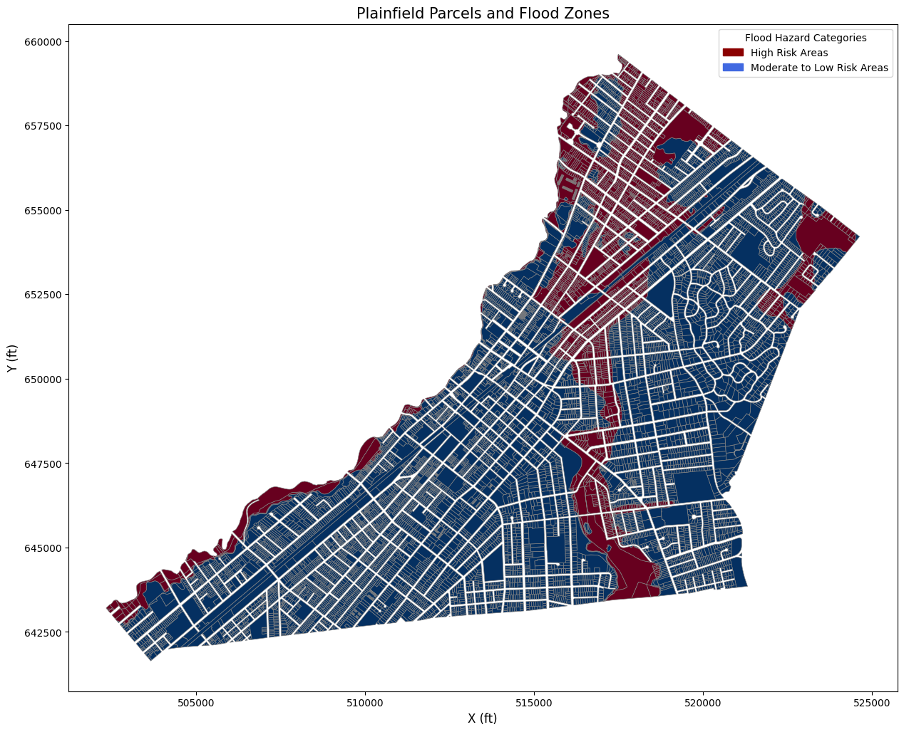
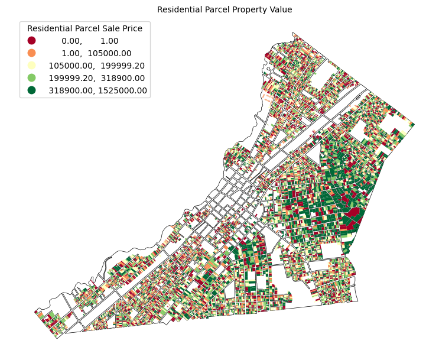

# **Command-Line GIS Final Project**
## Housing Parcels Located in Flood Zones (Plainfield, NJ)

Created by: Nicholas Seu

## Overview:
* **Static Map #1**: Plainfield Parcels and Flood Zones
* **Static Map #2**: Plainfield Residential Parcels By Property Value Located in Flood Zones
* **Interactive Webmap**: A map that displays Plainfield's Residential Parcels by Their Property Value, Flood Zones, and adds a 15-Minute Walking Buffer from the Plainfield Train Station

# Static Map #1: Plainfield Parcels and Flood Zones

# Static Map #2: Plainfield Residential Property Values

# Interactive Webmap

This map includes:
* Residential Parcels in Plainfield by Sale Value
* Flood Zones (High Risk or Moderate to Low Risk) Categorized by FEMA Flood Codes
* 15-Minute Walking Buffer from Plainfield Train Station
List item

<iframe src="interactive_map.html" height="855" width="95%"></iframe>

You can explore this map [as its own webpage here](test.html)

# Data Description:
